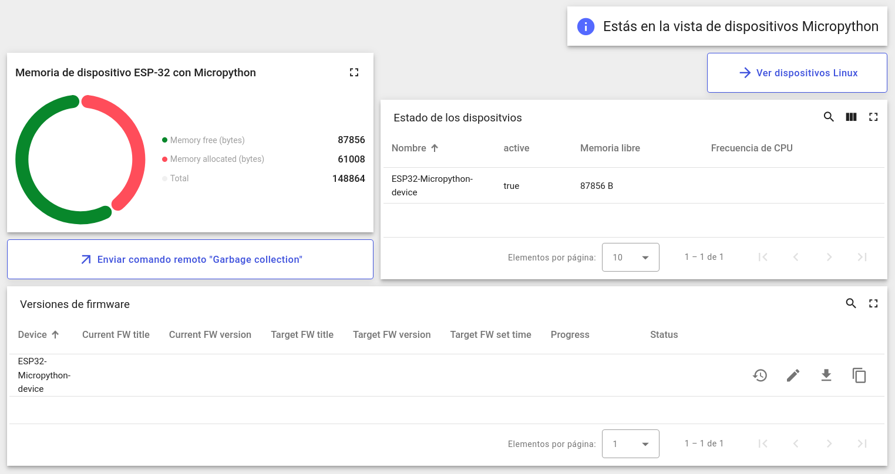

## Plataforma Thingsboard aplicada a una flota actualizable

> **Índice:**
> 1. [Despliegue del servidor](#despliegue-del-servidor)
> 2. [Configuración en Thingsboard](#configuración-en-thingsboard)
> 3. [Despliegue del Gateway de Thingsboard](#despliegue-del-gateway-de-thingsboard)
> 4. [Despliegue del Gateway MQTT-Lora](#despliegue-del-gateway-mqtt-lora)
> 5. [Indicaciones de uso](#indicaciones-de-uso)

### Despliegue del servidor

Levantar el contenedor de Thingsboard por primera vez:
```bash
cd platform/server
docker compose up -d
# ...Interfaz web a la escucha en http://localhost:8080/
```

Comandos útiles:
```bash
docker compose logs -f tb-server     # Consultar los logs
docker compose stop tb-server        # Detener el contenedor
docker compose start tb-server       # Reanudar el contenedor
```

Credenciales predeterminadas de la interfaz web:

| usuario                  | contraseña |
| ------------------------ | ---------- |
| sysadmin@thingsboard.org | sysadmin   |
| tenant@thingsboard.org   | tenant     |
| customer@thingsboard.org | customer   |


---

### Configuración en Thingsboard

Configuraremos Thingsboard desde su interfaz web.

**0. Ingresar a la web.**

Para tener los permisos necearios para hacer la configuración, ingresaremos como un usuario con el rol *tenant*.

**1. Importar recursos.**

El directorio [platform/resources](resources) contiene los siguientes archivos para preparar Thingsboard para la aplicación de ejemplo:

- `micropython_updatable_profile.json`

  Perfil de dipositivos *Micropython Updatable* (importar desde la sección *Perfiles de dispositivos*)

- `linux_updatable_profile.json`

  Perfil de dipositivos *Linux Updatable* (importar desde la sección *Perfiles de dispositivos*) POR IMPLEMENTAR

- `updatable_devices_dashboard.json`

  Panel *Updatable Devices* para visualizar la aplicación de ejemplo y lanzar actualizaciones OTA.
  (importar desde la sección *Tableros*)conclusión


**2. Crear dispositivos**

- Desde la sección *Entidades/Dispositivos* crearemos un nuevo dispositivo (p.ej. llamado ESP32-Micropython-device) y le asignaremos el perfil *Micropython Updatable*.

- Desde la misma sección crearemos otro dispositivo (p.ej. llamado RaspberryPiZero-Linux-device) y le asignaremos el perfil *Linux Updatable*.


---

### Despliegue del Gateway de Thingsboard

Véase: [platform/tb-gateway/README.md](tb-gateway/README.md)


---

### Despliegue del Gateway MQTT-Lora

Véase: [platform/lora-gateway/README.md](lora-gateway/README.md)


---

### Indicaciones de uso

Una vez realizadas la instalación y configuración, podemos empezar a jugar con el **panel Updatable Devices**, que funcionará plenamente cuando los dispositivos establezcan comunicación y ejecuten su programa de ejemplo.

Este panel está listo para gestionar correctamente 2 dispositivos: uno con el perfil *Micropython Updatable* y otro con el perfil *Linux Updatable*. El panel dispone de 2 vistas llamadas *Updatable Micropython Devices* y *Updatable Linux Devices* para gestionar ambos casos.



Para poner a prueba la actualización OTA en Micropython se sugiere seguir estos pasos:
1. Instalar el programa de ejemplo en el dispositivo siguiendo las indicaciones en [devices/micropython/README.md](../devices/micropython/README.md)
2. Arrancar el dispositivo y comprobar que aparece activo en el Dashboard.
3. Desde la sección de *Funciones Avanzadas > Actualizaciones OTA* cargar el paquete OTA de ejemplo ubicado en [devices/micropython/tools/example_ota_pkgs/micropython-OTA-client_v1.tar.gz](../devices/micropython/tools/example_ota_pkgs/micropython-OTA-client_v1.tar.gz). Nos aseguraremos de que título y versión coinciden con el `FW_METADATA.json` que contiene el paquete y que en *Perfil de dispositivo* seleccionamos *Micropython Updatable*.
4. Desde el Dashboard, usando el widget *Versiones de firmware*, asignar a nuestro dispositivo el paquete OTA que acabamos de agregar.
5. Comprobar cómo la actualización se realiza correctamente y empiezan a aparecer datos relativos a la variable *Frecuencia de CPU*, pues esa es una nueva característica de la versión v1, inexistente en la v0.
